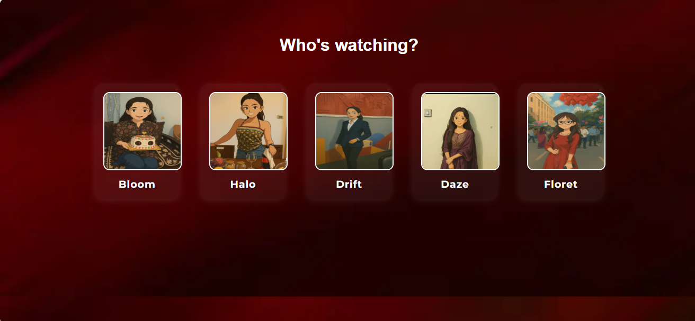
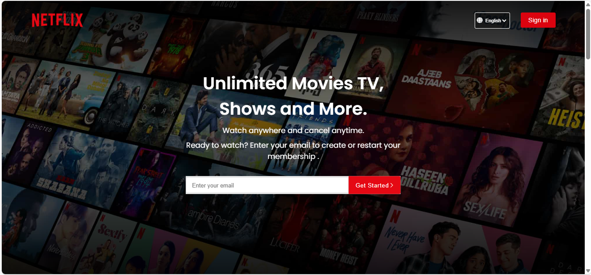
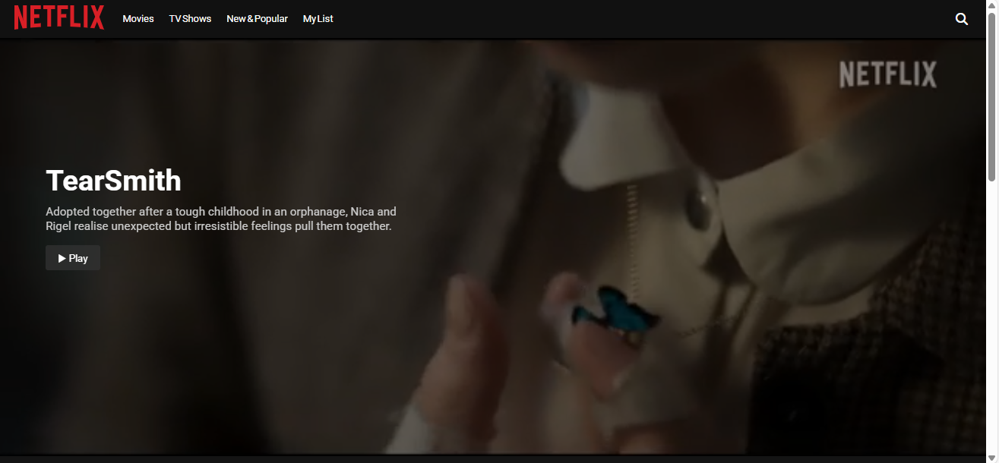
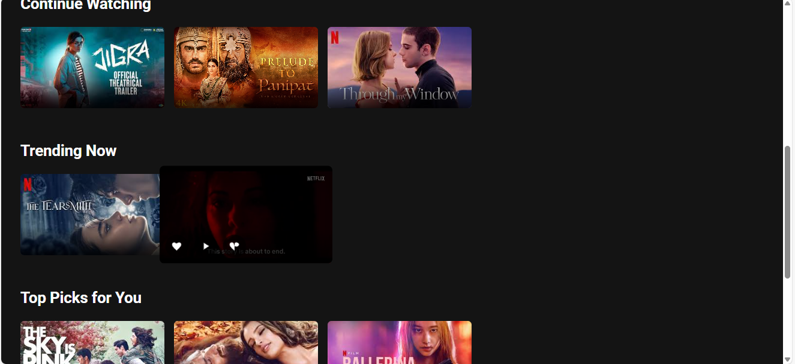
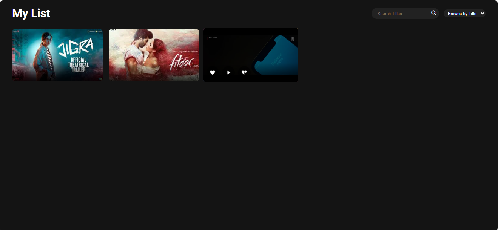

# 🎬 Floret – A Netflix-Style Streaming App  

## 📖 About the Project  
Floret is a Netflix-inspired web application built as a final-year project.  
It allows users to explore a movie-style interface, select profiles, and browse different sections like **Trending Now**, **Continue Watching**, and **Top Picks**.  

The app is built purely with **HTML, CSS, Bootstrap, and JavaScript**, showcasing skills in **frontend development**, **UI/UX design**, and building interactive web experiences.  

### Core functionality includes:  
- 🎥 Watch videos directly within the app  
- ❤️ Like videos  
- 📂 Save videos to playlist  
- 🔎 Search within playlist  
- 📊 Sort playlist videos (ascending, descending, or by search order)  

This project was developed using **NetBeans IDE**.  

---

## 📌 Features  
- Profile selection with animations  
- Movie-style homepage with sections (*Trending Now*, *Top Picks*, etc.)  
- Responsive design with Bootstrap  
- Interactive video player  
- Like / Save to Playlist functionality  
- Playlist management:  
  - Search videos in playlist  
  - Sort videos by ASC, DESC, or search relevance  

---
## ⚙️ Installation / Setup  
To run Floret locally:  

1. **Clone the repo**  
   ```bash
   git clone https://github.com/truptijangid13/NetflixClone1.git 
   cd NetflixClone1

2. **Open in NetBeans IDE**  
   - Launch NetBeans  
   - Import the project folder  

3. **Run the Project**  
   - Right-click the project → **Run**  
   - The app will open in your default browser 🚀
“You can also run this by simply opening index.html in any modern browser.”

## 🖼️ Screenshots  

- **Profile Selection**  
    

- **Homepage**  
    

- **Video Player**  
  
   

- **Playlist View**  
    

## 🛠️ Tech Stack  
- HTML, CSS, Bootstrap, JavaScript  
- NetBeans IDE  
- Git / GitHub

## 🚀 Future Enhancements
- 🔐 Add login & user authentication system
- 📡 Backend integration with database for storing playlists, likes, and history
- 🎯 Personalized recommendations based on watch history
- 🌙 Dark/Light mode toggle
- 📱 Mobile app version (React Native / Flutter)
- 🗂️ Categories & genres for better browsing
- 📝 User reviews & ratings

## 🌐 Live Demo  
Try it here: [Floret Demo](https://truptijangid13.github.io/NetflixClone1/)

  
## ⚠️ Note  
All rights reserved. This project is for personal/final-year project purposes only. Unauthorized use, copying, or distribution of this code is not allowed.
